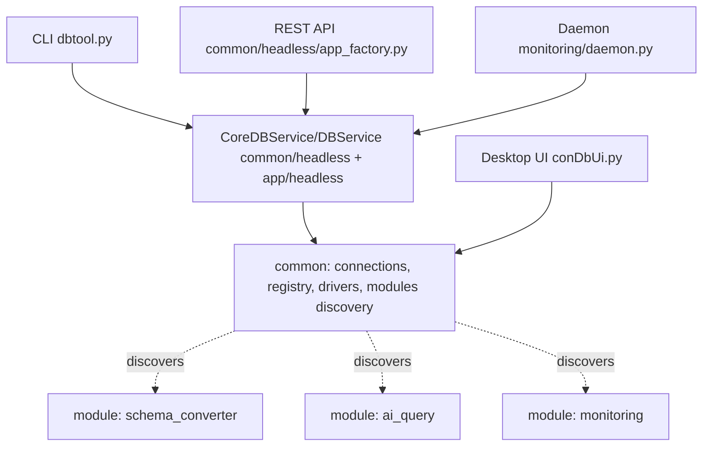

# DbManagementTool — How To Use

A practical, module-by-module guide to running every piece of functionality from the
three interfaces the tool exposes:

- **UI** — the Tkinter desktop application (`conDbUi.py`)
- **CLI** — the headless command-line tool (`dbtool.py`)
- **Console / API** — the REST API (`common/headless/app_factory.py` / `app/headless/api.py`) plus the programmatic service layers (`common/headless/db_service.py`, `app/headless/db_service.py`)

All three interfaces share the same business logic. The CLI and REST API are thin layers
over `DBService`; the UI uses the underlying modules directly.

> **Modular build:** Data Migration, the AI Query Assistant, Monitoring, and the
> advanced AI Assistant submodules (App Builder, RAG, LLM Training) are now
> **independently shippable modules** over a shared `core`. You can run the full combined
> tool, or ship/run any single module on its own. See
> [section 1.1](#11-modular-architecture--independent-shipping) and
> [`MODULES.md`](MODULES.md) for packaging details.

> **Adding a new feature?** Read
> [`docs/ADDING_FEATURES.md`](docs/ADDING_FEATURES.md) first — it describes the
> service-first layering used here and the exact CLI / API / UI / shell-menu
> wiring you need to touch so a feature lights up uniformly across every
> interface.

---

## Table of contents

1. [Architecture overview](#1-architecture-overview)
   - [1.1 Modular architecture & independent shipping](#11-modular-architecture--independent-shipping)
2. [Installation & setup](#2-installation--setup)
3. [Configuration files](#3-configuration-files)
4. [Supported databases](#4-supported-databases)
5. [UI (desktop app)](#5-ui-desktop-app)
6. [CLI (`dbtool.py`)](#6-cli-dbtoolpy)
7. [Console / REST API](#7-console--rest-api)
8. [Programmatic use (`DBService`)](#8-programmatic-use-dbservice)
9. [Monitoring, thresholds & alerts](#9-monitoring-thresholds--alerts)
10. [Cloud database monitoring & login](#10-cloud-database-monitoring--login)
11. [AI query assistant](#11-ai-query-assistant)
12. [Background daemon & service](#12-background-daemon--service)
13. [Feature coverage matrix](#13-feature-coverage-matrix)

---

## 1. Architecture overview

| Component | File / module | Purpose |
|-----------|---------------|---------|
| Desktop UI | `conDbUi.py` → `common/ui/master_shell.py` | Full graphical workflow |
| CLI | `dbtool.py` → `app/dbtool.py` | Scriptable command-line access |
| REST API | `common/headless/app_factory.py` + `app/headless/api.py` (FastAPI) | HTTP access for integrations |
| Service layer | `common/headless/db_service.py` / `app/headless/db_service.py` (`CoreDBService` / `DBService`) | Shared logic used by CLI/API/daemon |
| Core service | `common/headless/db_service.py` (`CoreDBService`) | Module-only CLI/API builds |
| Daemon | `monitoring/daemon.py` | Background monitoring loop |
| DB drivers | `common/drivers/con*.py` | Per-engine connection/query/object operations |
| DB registry | `common/database_registry.py` | Maps engine → operations |
| Cloud providers | `monitoring/cloud_providers/*_provider.py` | AWS/Azure/GCP monitoring plugins |
| Monitor UI | `monitoring/server_monitor/` | SSH/OS/DB/cloud monitoring tab |
| Schema conversion | `schema_converter/` | Cross-engine DDL generation (module) |
| AI query assistant | `ai_query/` | Natural-language → SQL (module) |
| AI Assistant advanced modules | `ai_assistant/app_builder`, `ai_assistant/rag`, `ai_assistant/llm` | App Builder, RAG Manager, LLM Training (advanced edition) |
| Monitoring | `monitoring/` | Metrics, thresholds, notifications, cloud (module) |
| Thresholds | `monitoring/threshold_checker.py` + `monitoring/monitor_thresholds.ini` | Alert rule evaluation |
| Notifications | `monitoring/send_notification.py` | MS Teams webhook alerts |



### 1.1 Modular architecture & independent shipping

The tool is split into a **shared core** plus three **optional modules**. The core
(connections, SQL editor/query, database objects, engine registry, the `core.modules`
discovery layer, CLI/API/UI shells) is always present. Each module is a self-contained
folder that plugs into the core through a **manifest** (`manifest.py`) exposing its CLI
commands, REST router, and UI panel.

| Module | Folder | CLI commands | API prefix | Adds UI tab |
|--------|--------|--------------|------------|-------------|
| Data Migration | `schema_converter/` | `migrator` | `/api/migrator/*` | Data Migration |
| AI Query Assistant | `ai_query/` | `ai` | `/api/ai/*` | AI Query Assistant |
| Monitoring | `monitoring/` | `monitor`, `daemon`, `thresholds`, `os`, `notify`, `cloud` | `/api/metrics`, `/api/thresholds/*`, `/api/os/*`, `/api/notify`, `/api/monitor/cloud/*`, `/api/daemon/status` | Monitor |

Always-available core commands: `connections`, `query`, `objects`, `databases`,
`config`, `api`, `ui`, `modules`.

**Shipping a single module** — copy the shared `core/` (plus its supporting root modules)
and just the one module folder. The master CLI/API/UI automatically discover whatever
modules are present. Anything missing is reported clearly instead of crashing:

```bash
# A build without Data Migration:
dbtool.py modules                       # lists migrator as installed=no
dbtool.py migrator convert ...          # -> "Module 'migrator' (Data Migration) is not installed"
```

**Discovering what's installed**

```bash
dbtool.py modules                       # table of modules: installed / ready / missing requirements
```

**Running a module standalone** (no master CLI) — each module is also a Python package
with its own entry point. CLI and API **always include the core** (connections, query,
objects). UI has three modes — **shell** (bash menu), **desktop** (Tk: Connections +
Objects + SQL Editor + module tab, from `common/ui/`), or **full tool** (all module tabs
via `dbtool ui`):

```bash
python -m schema_converter --help
python -m ai_query --help
python -m monitoring --help

# Shell UI — interactive bash menu (same as run_*.sh; no tkinter)
bash monitoring/run_monitor.sh
python -m ai_query --shell-ui
# (--lite-ui is an alias for --shell-ui)

# Desktop UI — Connections + Objects + SQL Editor + module tab (canonical: ``<module>/*_ui.py``)
python -m ai_query --ui              # → ai_query/ai_query_ui.py launch_ui()
python3.12 ai_query/ai_query_ui.py   # same entry

# Full tool — all installed module tabs
python dbtool.py ui
python dbtool.py ui --module monitor   # same desktop shell, one module tab

# CLI: core commands work on any module entry point
python -m monitoring connections list
python -m monitoring query --conn prod --sql "SELECT 1"

# API: core routes + module routes
python -m monitoring api --port 8001
```

See [`MODULES.md`](MODULES.md) for the full packaging, configuration, and
add-a-new-module guide.

---

## 2. Installation & setup

### 2.1 Automated install (recommended — Python 3.10+ only)

The installer checks Python, creates `.venv`, installs pip packages, copies config
examples, and verifies imports. **Linux, macOS, and Windows** use the same Python
installer (`setup/install.py`); shell wrappers handle OS-specific extras (tkinter, libpq, sshpass).

```bash
# Full tool — Linux / macOS
bash install.sh
# or: bash setup/install.sh

# Single module only
bash install.sh --module migrator    # migrator | ai | monitor | core | full
bash install.sh --module monitor --no-optional
```

```batch
:: Windows (cmd.exe / double-click)
install.bat
install.bat --module migrator
run.bat
```

```bash
# Any OS — Python only (no bash / cmd)
python setup/install.py --module full
python setup/install.py --module ai --skip-venv --python python3
```

This creates a `.venv`, installs the correct **requirement bundle** for the module
(see `setup/module_manifest.py`), copies `config.ini` / `properties.ini` from examples,
and generates `run.sh` / `run.bat`.

**Independent module shipping:** copy `common/` + one module folder (e.g. `schema_converter/`),
include `setup/`, `install.sh`, `install.bat`, then run `bash install.sh --module migrator`.
Full tool also needs `app/`, `dbtool.py`, and all module folders — see `MODULES.md`.

### 2.2 Manual install

```bash
python3 -m venv .venv
source .venv/bin/activate          # Windows: .venv\Scripts\activate
pip install -r setup/requirements-full.txt   # full tool
# or per module:
pip install -r setup/requirements-core.txt -r setup/requirements-drivers.txt
pip install -r setup/requirements-api.txt    # REST API
pip install -r setup/requirements-cloud.txt  # monitoring cloud providers
python setup/install.py --verify-only --module full --skip-venv
```

Core dependencies (`setup/requirements-core.txt`): `cryptography`, `python-dotenv`, `psutil`, `tabulate`.
Drivers (`setup/requirements-drivers.txt`): MySQL, PostgreSQL, SQL Server, MongoDB, Oracle (`oracledb`).
Cloud (`setup/requirements-cloud.txt`): AWS/Azure/GCP SDKs for monitoring.
REST API (`setup/requirements-api.txt`): `fastapi`, `uvicorn[standard]`.

> Oracle support also requires the Oracle Instant Client (set `oracle_client_path` in
> `config.ini` or the `ORACLE_HOME` env var). SQLite and Tkinter ship with Python.

### 2.3 Launching each interface

```bash
# UI (desktop)
./run.sh                       # Linux/macOS — full combined tool
run.bat                        # Windows — full combined tool
bash monitoring/run_monitor.sh          # monitoring bash menu
bash schema_converter/run_schema_converter.sh
bash ai_query/run_ai_query_assistant.sh

# Full module UI (Connections + Objects + SQL Editor + one module tab)
.venv/bin/python dbtool.py ui --module migrator     # migrator | ai | monitor
.venv/bin/python -m ai_query --ui

# Shell module UI (bash menu — same as run_*.sh above)
.venv/bin/python -m ai_query --shell-ui

# CLI
.venv/bin/python dbtool.py --help
.venv/bin/python dbtool.py modules                # see which modules are installed

# REST API
.venv/bin/python dbtool.py api --host 127.0.0.1 --port 8000
# docs at http://127.0.0.1:8000/docs
```

> **UI modes:** `run_*.sh` / `--shell-ui` = bash menu (no tkinter). `--ui` = desktop UI
> with Connections, Database Objects, SQL Editor + one module tab (from `common/ui/`, needs
> tkinter only). `dbtool ui` = same shell with all installed module tabs.

### 2.4 Shell UI quick tour

The shell UI is a numbered **bash menu** — no tkinter, no extra packages beyond what the
module CLI already needs. It works on macOS and Linux wherever `bash` is available.

**Launch (any module)**

```bash
bash schema_converter/run_schema_converter.sh
bash ai_query/run_ai_query_assistant.sh
bash monitoring/run_monitor.sh

# Same menus via Python:
python -m schema_converter --shell-ui    # --lite-ui is an alias
```

**How it works**

1. A numbered list appears; type the number and press Enter.
2. Prompts ask for connection names, SQL, table names, etc. (saved connections come from
   `config.ini`).
3. The menu runs `python -m <module> …` under the hood — same behavior as the CLI.
4. Press Enter after each action to return to the menu. Choose **Exit** to quit.

**What each module offers**

| Area | Data Migration | AI Query Assistant | Monitoring |
|------|------------------|--------------------|------------|
| **Connections** | List, add, test | List, add, test | List, add, test |
| **Module features** | List tables, show schema, convert to another DB type, transfer data, validate (compare schema/data), dump DDL | List backends, one-shot ask, sessions (new / ask / follow-up / exec SQL) | Poll once or loop, OS metrics, thresholds, cloud metrics, daemon start/stop, test notify |
| **Shared extras** | Run SQL, start REST API | Run SQL, start REST API | Start REST API |
| **Optional** | Open desktop Tk UI (needs tkinter) | same | same |

**Environment overrides** (non-standard installs)

```bash
export DBMT_ROOT=/path/to/DbManagementTool   # project root (parent of common/)
export DBMT_PYTHON=/path/to/.venv/bin/python # interpreter for menu actions
```

**When to use what**

| Goal | Use |
|------|-----|
| Interactive terminal, minimal deps | Shell UI (`run_*.sh` or `--shell-ui`) |
| Scripting / CI / automation | Module CLI or REST API |
| Full desktop with Connections + Objects + SQL Editor | `python -m <module> --ui` (ships with `common/`) |
| All module tabs in one window | `dbtool ui` or `./run.sh` (needs `app/` for master CLI only) |

Shared menu helpers live in `common/shell/menu_lib.sh`; module-specific actions are in
`<module>/shell_menu.sh`.

---

## 3. Configuration files

Each optional module owns its own INI file (shipped as `*.ini.example`). The core
**Settings** tab edits only `config.ini` and `properties.ini`. Module settings are
edited from that module's UI (**Monitor Settings**, **AI Settings**, **Migration
Settings**) or via module CLI/API — not from the core Settings tab.

| File | Owner | Purpose |
|------|-------|---------|
| `config.ini` | Core | Paths, DB ports/timeouts, security |
| `properties.ini` | Core | UI sizes, colors, panel limits |
| `monitoring/monitor_config.ini` | Monitoring | Refresh/keepalive, SSH timeouts, graph sizes, cloud lookback, notification routing (non-secret) |
| `monitoring/monitor_thresholds.ini` | Monitoring | Alert threshold rules (db / os / aws / azure / gcp) |
| `ai_query/config.ini` | AI Query | Backends, timeouts, cache limits, UI AI defaults |
| `schema_converter/config.ini` | Data Migration | Compare sample size, zero-date strategy, parallel workers, type overrides, conversion charset |
| `.env` | Optional | Legacy `ALERT_TEAMS_WEBHOOK_URL` fallback for Teams |
| `~/.dbassistant/` | Runtime | Encrypted secrets, saved profiles, daemon PID/log, sessions |

Live module INI files are created on first save (UI / CLI / API) from the matching
`.example` and are not committed to git.

Key **core** `config.ini` sections: `[paths]`, `[database.connection]`,
`[database.ports]`, `[security]`.

**Module config CLI / API:**

```bash
dbtool.py monitor-config show
dbtool.py monitor notify config
dbtool.py ai config show
dbtool.py migrator config show
```

```bash
curl -s http://127.0.0.1:8000/api/monitor/config
curl -s http://127.0.0.1:8000/api/monitor/notifications
curl -s http://127.0.0.1:8000/api/ai/config
curl -s http://127.0.0.1:8000/api/migrator/config
```

Saved DB credentials are encrypted at rest (`cryptography`); cloud connection secrets are
encrypted by `CloudConnectionManager`.

---

## 4. Supported databases

| Engine | Notes |
|--------|-------|
| Oracle | Requires Instant Client; uses `service` name |
| MySQL | `mysql-connector-python` |
| MariaDB | `mariadb` driver |
| PostgreSQL | `psycopg2-binary` |
| SQL Server / Azure SQL | `pymssql` — standard T-SQL in the SQL Editor |
| MongoDB | `pymongo` — document queries (JSON); object browser shows **Collections** |
| AWS DocumentDB | Same driver as MongoDB; TLS required — provide the RDS combined CA bundle path |
| SQLite | Built-in; `host` = file path |

Each engine exposes **capability metadata** (query language, schema conversion, transactions, etc.). The UI, CLI, and REST API use this to enable or disable features automatically — for example, MongoDB/DocumentDB hide the Data Migration schema tools and use the document query panel instead of SQL.

List engines and capabilities at runtime:

```bash
.venv/bin/python dbtool.py databases types
.venv/bin/python dbtool.py databases ops --type MongoDB
curl -s http://127.0.0.1:8000/api/databases/types | python -m json.tool
```

---

## 5. UI (desktop app)

Launch with `./run.sh`. The main window opens on the **Dashboard** tab and uses a tabbed notebook:

| Tab | What you can do |
|-----|------------------|
| **Welcome** | Landing page / documentation and usage guide |
| **Connections** | Add / edit / remove / test DB connections; passwords stored encrypted |
| **Dashboard** | In-tool activity overview for each tab. Optional modules (Monitor, AI, Data Migration) always appear as cards — missing ones show **Not installed** with setup hints. Reads app state only; does not poll databases |
| **Database Objects** | Browse tables, views, procedures, functions, indexes, triggers, sequences, constraints, and engine-specific objects (packages, synonyms, materialized views, tablespaces, roles, etc.). Buttons are generated per engine |
| **SQL Editor** | Write and run SQL (or JSON document queries for MongoDB/DocumentDB); multiple editor tabs; multiple result tabs; export results |
| **Data Migration** | Migrate tables across engines: convert DDL with type mapping, transfer data, and validate the migration (schema + data comparison); review conversion warnings |
| **AI Query Assistant** | Natural-language to SQL; pick an AI backend (Claude / Cursor / Codex); conversation history |
| **Monitor** | Local DB metrics, SSH server monitoring, and cloud DB monitoring |
| **Clear Cache** | Clears AI schema/conversation caches and reloads credentials from disk (active sessions preserved) |

### 5.1 Connections tab
1. Click **Add database connection**, choose the engine, fill host/port/user/password (and
   service for Oracle, or file path for SQLite).
2. For **MongoDB**, optionally enable TLS and set a CA file path. For **DocumentDB**, TLS
   is enabled automatically — set the path to the AWS RDS combined CA bundle
   (`global-bundle.pem`).
3. For **MySQL, MariaDB, PostgreSQL, SQL Server, and Oracle**, optional **SSL mode** and
   certificate fields appear when that engine is selected (driven by capability metadata).
   Leave SSL mode as **disable** for plain local connections; use **require** or
   **verify_ca** / **verify-full** with your cloud CA bundle for RDS, Azure, etc.
4. **Test** verifies connectivity and shows the server version.
5. Credentials are saved encrypted under `~/.dbassistant/` (SSL paths are saved with the profile).

The Connections tab stacks three registration sections:
**Add database connection** (direct), **Add remote database connection**
(SSH tunnel), and **Add cloud database connection** (AWS / Azure / GCP).

#### Add remote database connection (SSH tunnel)
Use this for a database that is only reachable through a bastion / jump host.
The tool opens an SSH **local port-forward** and connects the driver to the
local end automatically — no manual `ssh -L` needed.

1. Expand **Add remote database connection** (between the direct and cloud
   sections).
2. Enter the connection name and pick the engine.
3. Under **Database (from SSH host's view)**, enter the DB host/port **as seen
   from the SSH host** (commonly `localhost`), plus the database/service and DB
   username/password.
4. Under **SSH tunnel**, enter the SSH host, port (default `22`), and username,
   then choose **Password** or **Key file** authentication.
   - Password auth requires `sshpass` on `PATH`
     (`brew install sshpass` / `apt-get install sshpass`).
   - Key-file auth needs no extra tooling.
5. **Test Connection** opens the tunnel and verifies the DB login; **Connect**
   adds it to active connections (usable from SQL Editor, Objects, Migration,
   AI). **Save** stores the encrypted profile (SSH password encrypted at rest);
   **Load Saved** lists previously saved remote connections.

The tunnel lives as long as the connection is open and is torn down on
disconnect. The same remote connection works from the CLI (`connections add
--ssh-host …`) and REST API (`ssh_tunnel` object).

### 5.2 Database Objects tab
- Select a connection, then choose an **object type** from the left panel.
- **Tables** (or **Collections** on MongoDB/DocumentDB) open as cards: **▶** loads column schema, **Load Sample Data** shows one row, **Export Data** saves rows.
- Use the **Filter** box to narrow long object lists; other object types appear in a sortable list view.
- **Export Data** writes all rows to CSV (SQL engines) or JSON/CSV (document engines). Optional cap: `table_export_max_rows` in `[ui.limits]` (0 = unlimited).
- The set of object-type buttons adapts to the selected engine's capabilities.

### 5.3 SQL Editor tab
- **Multiple editor tabs:** click **+** after the last tab to open another session; click **×** on a tab to close it (at least one tab always stays open). Each tab has its own connection, query text, and result tabs. **SQL → New editor tab** / **Close editor tab** also work from the menu.
- Run a statement or a multi-statement script; each result opens in its own sub-tab;
  results can be exported.
- **Auto-commit / Commit / Rollback:** the per-tab **Auto-commit** checkbox reflects
  the selected connection's live autocommit state. Its initial value comes from
  `[database.connection] default_autocommit` in `config.ini` (default `true`); toggling
  it applies immediately to that connection for this session. With Auto-commit **off**,
  use the **Commit** / **Rollback** buttons to finalize changes. Changing the default in
  the **Settings** tab applies it to open SQL Editor tabs and to future connections.
  Autocommit handling is engine-aware (PostgreSQL ends any open transaction before the
  switch; SQL Server uses its method API; SQLite maps to `isolation_level`).
- **MongoDB / DocumentDB:** the editor switches to **Document Query (JSON)** mode.
  Example find query:

```json
{"collection": "users", "operation": "find", "filter": {"status": "active"}, "limit": 50}
```

  Supported operations: `find`, `aggregate`, `count`. Commit/rollback and Execute All
  are disabled for document engines (no SQL transactions).

### 5.4 Data Migration tab
- Pick a source connection + table and a target engine; the tool generates
  `CREATE TABLE`/index DDL and lists any conversion caveats.
- **Type mapping rules** — optional overrides such as `"varchar2:text,int:decimal"`
  (UI field, CLI `--type-map`, API `type_map`). Defaults can be saved in
  `schema_converter/config.ini` (`type_overrides`).
- **Conversion charset** — `conversion_charset` in Migration Settings (default
  `utf-8`) controls multibyte text transfer; MySQL/MariaDB targets use `utf8mb4`
  when appropriate.
- **Advanced transfer options** (UI fields, CLI flags, API fields):
  - Row filter (`--where`) and column subset (`--columns`) apply to
    **single-table transfers only** — the UI greys them out when more than one
    table is selected, and the multi CLI/API reject them.
  - Column rename (`--column-map`) and the row **limit** (`--limit`) apply to
    **every selected table** (a rename is a no-op for tables that lack a listed
    source column).
  - Fixed-value policies live in **⚙ Migration Settings**
    (`schema_converter/config.ini`) and act as defaults; CLI/API can still
    override per run: `--continue-on-error` keeps going on bad rows and reports
    them; `--overflow-policy fail|truncate|skip` for values larger than the
    target column; `--null-policy` / `--bool-policy` normalize NULL/empty/boolean;
    `--timezone-policy preserve|naive|utc|target` (+ `--target-timezone`);
    `--reset-sequences` resets target auto-increment after load.
  - `--checkpoint` resumes interrupted transfers; `--report FILE.json` writes a
    run report (rows, skipped, errors, durations, mismatches).
- **Pre-migration dry-run** — `migrator validate` / `POST /api/migrator/validate`
  / **Validate (Dry-run)** button reports type incompatibilities, oversized
  columns, and unsupported defaults without moving any rows.
- Apply the generated DDL to the target, then **transfer data** in batches
  (optional parallel workers via `parallel_workers` / UI checkbox).
- **Validate** the migration: compare schema and data (row counts, sampled or full
  row-by-row comparison) between source and target.
- Relational engines appear for schema conversion. MongoDB/DocumentDB connections
  are available for **document-to-document data transfer**; RDBMS ↔ document
  pairs are blocked with a clear message.

### 5.5 Monitor tab (local + SSH + cloud)
- **Add Connection** (Server section) registers an SSH server for OS-level monitoring.
- **Add Database** (Database Monitoring section) is a dropdown — choose
  **Localhost / direct database** or **Remote database (SSH tunnel)**. Either
  saves a DB connection that is **owned by the Monitor module only**. These
  profiles live in a separate store
  (`<DBASSISTANT_HOME>/connections/monitor_db.json`) and are deliberately
  **isolated** — they are *not* visible to the SQL Editor, Data Migration or AI
  Query tabs. The Monitor tab can still use Connections-tab profiles too. Manage
  the same store headless via `monitor-db` CLI commands and the
  `/api/monitor/db-connections` API.
  - **Remote database (SSH tunnel):** the add-database dialog shows an **SSH
    tunnel** section. The DB host/port are the endpoint *as seen from the SSH
    host* (often `localhost`); enter the bastion SSH host/port/user and choose
    **Password** (needs `sshpass`) or **Key file** auth. Monitoring opens the
    tunnel automatically when the database is selected for monitoring, exactly
    like the Connections tab's *Add remote database connection*.
- **Add Cloud Resource** registers a cloud database/resource (AWS/Azure/GCP) — see
  [section 10](#10-cloud-database-monitoring--login). The connection dialog has auth tabs:
  **Access Keys / Tokens**, **Username / Password**, and **IAM Identity Center / aws login**
  (AWS) / device-code (Azure/GCP).
- **Monitor Settings** (top-right) edits `monitor_config.ini` (refresh/keepalive,
  SSH, cloud lookback, notification routing). **Alert Thresholds** edits
  `monitor_thresholds.ini`.
- **Select Database** activates monitoring for a registered DB target (Connections-tab
  *or* Monitor-only); **Select Resource** activates cloud resource monitoring. Metrics
  refresh on `metrics_refresh_interval` from `monitor_config.ini` (not core `config.ini`).

---

## 6. CLI (`dbtool.py`)

Run any command with `.venv/bin/python dbtool.py <command> ...`. Global flags:

| Flag | Effect |
|------|--------|
| `--format table\|json\|csv` | Output format (default `table`) |
| `--no-color` | Disable ANSI colors |

> `--format` is also accepted on individual data commands. Set `DBTOOL_DEBUG=1` to print
> tracebacks on error.

> **Module commands are gated.** `schema`, `ai`, `monitor`, `daemon`, `thresholds`, `os`,
> `notify`, and `cloud` belong to optional modules. If the owning module is not present in
> your build, the command prints a clear *"Module … is not installed"* message (with the
> folder to ship to enable it) and exits non-zero instead of failing obscurely. Run
> `dbtool.py modules` to see what's installed.

### 6.0 Modules & UI launcher

```bash
dbtool.py modules                       # list modules: installed / ready / missing requirements
dbtool.py ui                            # launch the combined desktop app (installed tabs only)
dbtool.py ui --module migrator          # full UI: Connections + Objects + SQL + Data Migration
dbtool.py ui --module ai                # full UI: Connections + Objects + SQL + AI
dbtool.py ui --module monitor           # full UI: Connections + Objects + SQL + Monitor
# Lite UI (module panel only): bash monitoring/run_monitor.sh | ai_query/run_ai_query_assistant.sh | schema_converter/run_schema_converter.sh
```

### 6.1 Connections

```bash
dbtool.py connections list
dbtool.py connections add --name prod --type PostgreSQL --host db.example.com \
    --user app --port 5432 --db appdb            # prompts for password
dbtool.py connections add --name ora1 --type Oracle --host h --user u --service ORCLPDB1
dbtool.py connections test prod
dbtool.py connections remove prod
```
- `--service` is for Oracle; `--db` for the others. Omit `--password` to be prompted
  (recommended). Passwords are stored encrypted.

### 6.2 Query

```bash
dbtool.py query --conn prod --sql "SELECT * FROM users LIMIT 10"
dbtool.py query --conn prod --file ./report.sql --format json
dbtool.py query --conn prod --sql "UPDATE t SET x=1 WHERE id=5"   # DML returns rowcount
```

### 6.3 Objects

```bash
dbtool.py objects --conn prod --type tables
dbtool.py objects --conn mongo1 --type collections   # MongoDB / DocumentDB alias
dbtool.py objects --conn prod --type processlist --format json
```
Accepted `--type` values (engine-dependent — unsupported types return a clear error):
`tables, collections, views, procs, functions, indexes, triggers, sequences, constraints, events,
databases, users, schemas, tablespaces, engines, charsets, processlist, roles,
extensions, synonyms, packages, types, materializedviews, databaselinks, profiles,
sessions, activity`. Multi-column object types (e.g. `processlist`, `users`) render as a
table.

### 6.4 Data Migration

```bash
dbtool.py migrator show    --conn prod --table users
dbtool.py migrator dump    --conn prod --table users --output users.sql   # omit --table for all tables
dbtool.py migrator convert --source-conn prod --target-type MySQL --table users \
    --type-map "varchar2:text" --target-db test --output users_mysql.sql
dbtool.py migrator apply   --target-conn target_mysql --ddl-file users_mysql.sql
dbtool.py migrator transfer-data --source-conn prod --target-conn target_mysql --table users
dbtool.py migrator compare-schema --source-conn prod --target-conn target_mysql --table users
dbtool.py migrator compare-data   --source-conn prod --target-conn target_mysql --table users
```

### 6.5 AI

```bash
dbtool.py ai --conn prod "show tables with more than 1000 rows"
dbtool.py ai --conn prod --backend cursor "top 5 customers by revenue"
dbtool.py ai --list-backends           # list configured backends (* = active)
```
Backends: `claude`, `cursor`, `codex` (configured in `ai_query/config.ini`; core
`config.ini` `[ai]` keys are legacy). Without `--backend` the first available backend
is auto-selected. The `claude` and `codex` CLIs are resolved via an optional
`cli_path`, then `PATH`, then common install dirs (`~/.local/bin`, Homebrew, …) so they
work under a minimal GUI `PATH`.

### 6.6 Monitor (foreground)

```bash
dbtool.py monitor --conn prod,stage --interval 30          # loop until Ctrl+C
dbtool.py monitor --conn prod --once                       # single poll
dbtool.py monitor --once --output metrics.json             # all saved conns -> JSON
```
Breached thresholds print colored alerts and dispatch a notification (Teams webhook).

### 6.7 Daemon

```bash
dbtool.py daemon start --connections prod,stage --interval 60   # background (Unix double-fork)
dbtool.py daemon start --foreground                             # for Docker / systemd
dbtool.py daemon status
dbtool.py daemon stop
```
Defaults: PID `~/.dbassistant/runtime/daemon.pid`, log `~/.dbassistant/runtime/daemon.log`, metrics
`~/.dbassistant/runtime/metrics.json` (the REST API reads this snapshot for `GET /api/metrics`).

### 6.8 REST API server

```bash
dbtool.py api --host 0.0.0.0 --port 8000        # add --reload for dev auto-reload
```

### 6.9 Databases (engine registry)

```bash
dbtool.py databases types
dbtool.py databases ops --type Oracle
```

### 6.10 Thresholds

```bash
dbtool.py thresholds list --source db
dbtool.py thresholds list --source db --path mysql      # per-engine DB rules
dbtool.py thresholds show  --source db --metric active_connections
dbtool.py thresholds show  --source db --path postgresql --metric active_connections
dbtool.py thresholds check --source db --metric active_connections --value 250 --instance prod
```
Sources: `db | os | aws | azure | gcp`. Rules live in `monitoring/monitor_thresholds.ini`.
Local DB metrics support per-engine overrides via `--path <engine>` (`mysql`,
`mariadb`, `oracle`, `postgresql`, `sqlite`), with fallback to the generic
`[metric.db.*]` rule.

### 6.11 Config

```bash
dbtool.py config show                  # all sections
dbtool.py config show --section ai
```

### 6.12 Notify

```bash
dbtool.py notify send --severity WARNING --message "Disk almost full on prod"
```
Requires `ALERT_TEAMS_WEBHOOK_URL` in `.env`.

### 6.13 OS metrics (host)

```bash
dbtool.py os metrics
dbtool.py os metrics --disk /var --format json
```

### 6.14 Cloud

```bash
dbtool.py cloud connections list
dbtool.py cloud connections add --name prod-rds --provider aws --json ./rds.json
dbtool.py cloud connections test prod-rds
dbtool.py cloud connections remove prod-rds

dbtool.py cloud login   --name prod-rds      # interactive aws login / aws sso login / az login / gcloud
dbtool.py cloud metrics --name prod-rds
dbtool.py cloud monitor --name prod-rds --interval 30        # --once for single poll
```
The `--json` profile is a provider connection dict (must include a `provider` key). For
keyless AWS auth (profile / `aws login` / SSO), omit static keys and run `cloud login`
first; `build_monitor` then uses the default credential chain. See
[section 10](#10-cloud-database-monitoring--login).

---

## 7. Console / REST API

Start the server (`dbtool.py api ...`), then browse interactive docs at
`http://<host>:<port>/docs` (OpenAPI at `/openapi.json`). All routes are under `/api`.
Examples use `curl`.

> **Module routes are mounted dynamically.** Core routes (health, connections, query,
> objects, config, databases) are always present. The schema, AI, thresholds, OS, notify,
> cloud, and metrics routes only appear when their module is installed — check
> `GET /api/modules`. A standalone module API (`python -m <module> api`) serves the
> same core routes plus only that module's routes.

### 7.1 Health & modules

```bash
curl http://localhost:8000/api/health
curl http://localhost:8000/api/modules     # which feature modules are installed/ready
```

### 7.2 Connections

```bash
curl http://localhost:8000/api/connections
curl -X POST http://localhost:8000/api/connections \
  -H 'Content-Type: application/json' \
  -d '{"name":"prod","db_type":"PostgreSQL","host":"db","port":"5432","user":"app","password":"secret","database":"appdb"}'
curl -X POST   http://localhost:8000/api/connections/prod/test
curl -X DELETE http://localhost:8000/api/connections/prod
```

### 7.3 Query & objects

```bash
curl -X POST http://localhost:8000/api/query \
  -H 'Content-Type: application/json' \
  -d '{"connection":"prod","sql":"SELECT 1"}'
curl "http://localhost:8000/api/objects/prod?type=tables"
curl "http://localhost:8000/api/objects/prod?type=processlist"
```

### 7.4 Metrics

```bash
curl http://localhost:8000/api/metrics                 # all (daemon snapshot if present)
curl http://localhost:8000/api/metrics/prod            # live, with alerts
```

### 7.5 Data Migration

```bash
curl -X POST http://localhost:8000/api/migrator/convert \
  -H 'Content-Type: application/json' \
  -d '{"source_conn":"prod","target_type":"MySQL","table":"users"}'
curl "http://localhost:8000/api/migrator/prod/users"     # columns + indexes
curl "http://localhost:8000/api/migrator/prod/dump?table=users"   # DDL (omit table for all)
curl -X POST http://localhost:8000/api/migrator/transfer-data \
  -H 'Content-Type: application/json' \
  -d '{"source_conn":"prod","target_conn":"target_mysql","table":"users"}'
curl -X POST http://localhost:8000/api/migrator/compare-data \
  -H 'Content-Type: application/json' \
  -d '{"source_conn":"prod","target_conn":"target_mysql","table":"users","mode":"sample"}'
```

### 7.6 AI

```bash
curl -X POST http://localhost:8000/api/ai/query \
  -H 'Content-Type: application/json' \
  -d '{"connection":"prod","question":"list inactive users","backend":""}'
curl http://localhost:8000/api/ai/backends
```

### 7.7 Thresholds

```bash
curl "http://localhost:8000/api/thresholds?source=db"
curl "http://localhost:8000/api/thresholds/db/active_connections"
curl "http://localhost:8000/api/thresholds/db/active_connections?path=postgresql"
curl -X POST http://localhost:8000/api/thresholds/check \
  -H 'Content-Type: application/json' \
  -d '{"source":"db","metric":"active_connections","value":250,"instance":"prod"}'
```

### 7.8 OS / config / databases / notify

```bash
curl "http://localhost:8000/api/os/metrics?disk=/"
curl "http://localhost:8000/api/config?section=ai"
curl http://localhost:8000/api/databases/types
curl "http://localhost:8000/api/databases/ops?type=MySQL"
curl -X POST http://localhost:8000/api/notify \
  -H 'Content-Type: application/json' \
  -d '{"severity":"WARNING","message":"test alert"}'
```

### 7.9 Cloud

```bash
curl http://localhost:8000/api/monitor/cloud/connections
curl -X POST http://localhost:8000/api/monitor/cloud/connections \
  -H 'Content-Type: application/json' \
  -d '{"name":"prod-rds","profile":{"provider":"aws","region":"ap-northeast-1","resource_name":"mydb"}}'
curl -X POST   http://localhost:8000/api/monitor/cloud/connections/prod-rds/test
curl -X POST   http://localhost:8000/api/monitor/cloud/connections/prod-rds/login   # opens browser on the SERVER host
curl    http://localhost:8000/api/monitor/cloud/metrics/prod-rds
curl -X DELETE http://localhost:8000/api/monitor/cloud/connections/prod-rds
```

### 7.10 Daemon status

```bash
curl http://localhost:8000/api/daemon/status
```

> **Security note:** Daemon start/stop is intentionally **not** exposed over HTTP.
> `/api/monitor/cloud/connections/{name}/login` shells out to `aws`/`az`/`gcloud` and opens a
> browser on the host running the API — intended for local/dev use only. The API allows all
> CORS origins by default; restrict this before exposing it on a network.

### 7.11 Endpoint summary

| Method | Path | Purpose |
|--------|------|---------|
| GET | `/api/health` | Liveness |
| GET | `/api/modules` | Installed feature modules |
| GET / POST | `/api/connections` | List / create connection |
| DELETE | `/api/connections/{name}` | Remove connection |
| POST | `/api/connections/{name}/test` | Test connection |
| POST | `/api/query` | Run SQL |
| GET | `/api/objects/{conn}?type=` | List objects |
| GET | `/api/metrics`, `/api/metrics/{conn}` | Metrics |
| POST | `/api/migrator/convert` | Convert DDL |
| POST | `/api/migrator/transfer-data` | Copy rows source → target (filter, policies, checkpoint, report) |
| POST | `/api/migrator/validate` | Pre-migration dry-run report (no rows moved) |
| POST | `/api/migrator/compare-schema` | Compare table schemas |
| POST | `/api/migrator/compare-data` | Compare table data |
| GET | `/api/migrator/{conn}/{table}` | Table columns/indexes |
| GET | `/api/migrator/{conn}/dump?table=` | CREATE DDL |
| POST | `/api/ai/query` | NL -> SQL |
| GET | `/api/ai/backends` | List AI backends |
| GET | `/api/thresholds?source=` | List rules |
| GET | `/api/thresholds/{source}/{metric}` | Show rule |
| POST | `/api/thresholds/check` | Evaluate value |
| GET | `/api/os/metrics?disk=` | Host metrics |
| GET | `/api/config?section=` | Config values |
| GET | `/api/databases/types` | Engines |
| GET | `/api/databases/ops?type=` | Engine operations |
| POST | `/api/notify` | Send notification |
| GET / POST | `/api/monitor/cloud/connections` | List / create cloud conn |
| DELETE | `/api/monitor/cloud/connections/{name}` | Remove cloud conn |
| POST | `/api/monitor/cloud/connections/{name}/test` | Health-check cloud conn |
| POST | `/api/monitor/cloud/connections/{name}/login` | Interactive cloud login |
| GET | `/api/monitor/cloud/metrics/{name}` | Cloud metrics |
| GET | `/api/daemon/status` | Daemon status |

---

## 8. Programmatic use (`DBService`)

The same logic is callable directly from Python (no UI, no HTTP):

```python
from app.headless.db_service import DBService

svc = DBService()

# Connections
svc.add_connection(name="prod", db_type="PostgreSQL", host="db", port="5432",
                   user="app", password="secret", database="appdb")
print(svc.test_connection("prod"))

# Query
res = svc.execute("prod", "SELECT 1")
print(res["columns"], res["rows"])

# Objects (engine-dependent types) and schema
print(svc.get_objects("prod", "tables"))
print(svc.get_table_schema("prod", "users"))
print(svc.dump_schema("prod", table="users")["ddl"])

# Metrics + alerts
m = svc.get_metrics("prod")
print(svc.check_alerts("prod", m["raw_floats"]))

# AI
print(svc.list_ai_backends())
print(svc.ai_query("prod", "count rows in users", backend="cursor"))

# Cloud
print(svc.cloud_login("prod-rds"))
print(svc.get_cloud_metrics("prod-rds")["text"])

svc.disconnect_all()
```

Notable methods: `list_connections`, `add_connection`, `remove_connection`,
`test_connection`, `execute`, `get_objects`, `supported_object_types`, `get_table_schema`,
`dump_schema`, `convert_schema`, `get_metrics`, `check_alerts`, `ai_query`,
`list_ai_backends`, `list_db_types`, `list_db_ops`, `list_thresholds`, `show_threshold`,
`check_threshold`, `get_os_metrics`, `send_notification`, `show_config`,
`list_cloud_connections`, `add_cloud_connection`, `remove_cloud_connection`,
`test_cloud_connection`, `cloud_login`, `get_cloud_metrics`.

---

## 9. Monitoring, thresholds & alerts

- **Metrics** are collected from the database (`db_metric_config.collect_metrics`) and the
  host OS (`db_os_collector`). The UI Monitor tab also supports SSH-based server metrics.
- **Thresholds** are defined in `monitoring/monitor_thresholds.ini` per `(source, metric)` with
  `critical` / `warning` / `info` levels, an `operator`, optional `unit`, and a `window`
  (number of consecutive breaches required to fire — sustained-breach logic).
- **Alerts** fire when a metric sustains a breach. They print in the CLI/daemon and are
  dispatched to MS Teams via `ALERT_TEAMS_WEBHOOK_URL`.

Inspect and test rules without a live DB:

```bash
dbtool.py thresholds list
dbtool.py thresholds check --source os --metric cpu_percent --value 99
```

---

## 10. Cloud database monitoring & login

Supported providers: **AWS** (RDS/Aurora via CloudWatch + Performance Insights),
**Azure** (Azure Monitor), **GCP** (Cloud SQL via Cloud Monitoring).

### 10.1 Authentication options

| Provider | Options |
|----------|---------|
| AWS | Static access keys; **IAM Identity Center (SSO)** via Start URL; **`aws login`** (console credentials) using a named profile |
| Azure | Service principal keys; `az login` (device code) |
| GCP | Service-account JSON; `gcloud auth application-default login` |

For keyless AWS, leave the Start URL blank and use the `aws login` flow (a named profile is
optional). `build_monitor` resolves credentials through boto3's default chain, so once you
have logged in (`cloud login` / `aws login` / `aws sso login`), monitoring works without
storing secrets.

### 10.2 UI flow
Monitor tab -> **Add Cloud Resource** -> pick provider -> choose an auth tab
(**Access Keys / Tokens**, **Username / Password**, or **IAM Identity Center / aws login**)
-> **Test Connection** (runs the device/login flow if needed) -> **Select Resource** to
activate monitoring.

### 10.3 CLI flow

```bash
# 1. Register the connection from a JSON profile (must contain "provider")
dbtool.py cloud connections add --name prod-rds --provider aws --json ./rds.json
# 2. Authenticate interactively (opens a browser)
dbtool.py cloud login   --name prod-rds
# 3. Verify and fetch metrics
dbtool.py cloud connections test prod-rds
dbtool.py cloud metrics --name prod-rds
dbtool.py cloud monitor --name prod-rds --interval 30
```

Example AWS profile JSON (`rds.json`):

```json
{
  "provider": "aws",
  "region": "ap-northeast-1",
  "resource_name": "my-rds-instance",
  "sso_profile": "myprofile"
}
```

> AWS metrics use **CloudWatch first, Performance Insights as fallback** for metrics
> CloudWatch does not return (CPU, memory, disk-queue) when PI is enabled on the instance;
> PI-sourced values are marked `(PI)`.

### 10.x Cloud metric lookback (`monitoring/monitor_config.ini`)

Each poll queries the provider's metrics API over a recent time window and shows
the **newest** datapoint in it (no averaging). The window per provider is set in
`monitoring/monitor_config.ini` — a module-owned file shipped with Monitoring,
separate from `config.ini`:

```ini
[cloud.lookback]
aws_lookback_minutes = 10
azure_lookback_minutes = 15
gcp_lookback_minutes = 15
```

This is the search window, **not** the poll rate (that's `metrics_refresh_interval`
/ `--interval`). Range `1`–`1440`; edits apply on the next refresh; missing values
fall back to the defaults above.

---

## 11. AI query assistant

Converts natural language to SQL using a CLI-based backend (no API key — uses your existing
CLI login session):

| Backend | Config section | Install |
|---------|----------------|---------|
| `claude` | `[ai.claude]` | https://claude.ai/download |
| `cursor` | `[ai.cursor]` | https://cursor.com |
| `codex` | `[ai.codex]` | https://github.com/openai/codex |

Set the default in `ai_query/config.ini` (`[ai] default_backend = auto|claude|cursor|codex`)
or use **AI Settings** on the AI Query tab. Core `config.ini` `[ai]` keys are legacy
fallbacks when the module file is absent.

```bash
dbtool.py ai --list-backends
dbtool.py ai --conn prod --backend claude "which tables reference order_id?"
```

The UI's **AI Query Assistant** tab adds a backend selector, schema-aware context, and
conversation history.

**Safety guarantee:** AI Query Assistant and App Builder never execute mutating
SQL on live database connections. `DROP`, `DELETE`, `UPDATE`, `INSERT`,
`TRUNCATE`, `ALTER`, `CREATE`, `MERGE`, `GRANT`, and similar statements are
blocked in the shared execution layer before they can reach the driver. This
applies to Tk, TUI, Web, CLI, API, headless, auto-execute, and cross-tab/session
execution. Use the SQL Editor or Data Migration module for intentional writes.

### Multi-tab workspace and cross-tab syntax

The AI Query Assistant supports **multiple parallel tabs** inside one workspace.
Each tab has its own connection, AI backend, and conversation history.

- **+ New Tab** opens another session; **Close Tab** closes the selected tab (at least one tab stays open).
- When closing, choose **Yes** to save that session into `~/.dbassistant/session/ai_sessions/sessions.json` for later.
- **Save Sessions** writes all open tabs and keeps any sessions you saved on close.
- **Load Sessions** restores every entry from that file as tabs (backend resume IDs are reused when available).
- Storage is lightweight: sessions with a backend resume ID save only the ID + settings (not full chat history); others keep up to 20 messages. `max_stored_sessions` in `[ai.limits]` (`ai_query/config.ini`) caps how many sessions are kept on save (`0` = keep all, the default).
- Tab labels show `Tab N · connection (backend)`.

**Cross-tab references** (parsed in chat and CLI):

| Syntax | Behavior |
|--------|----------|
| `@tab2`, `tab 2`, `use tab 2` | Pull context from tab 2 into the current tab's prompt |
| `talk to tab 3: ...` | Route the message to tab 3; read-only SQL runs on tab 3's connection |
| `use tab 2 and tab 4: ...` | Team coordination across referenced tabs |

Query execution is **tab-bound**: SQL always runs on the tab that owns the connection.
Other tabs receive **result summaries**, not live cross-database cursors.

**CLI session commands:**

```bash
dbtool.py ai session list
dbtool.py ai session new --conn prod --backend claude
dbtool.py ai session ask --session tab1 "show top customers"
dbtool.py ai session follow-up --session tab1 "add a date filter"
dbtool.py ai session cross --session tab1 "use tab 2: count rows in orders"
dbtool.py ai session close --session tab2
dbtool.py ai session save
dbtool.py ai session load
```

Stateless one-shot queries remain: `dbtool.py ai --conn prod "question"`.

**REST API:** `POST /api/ai/query`, `POST /api/ai/execute-sql`,
`POST/GET/PATCH/DELETE /api/ai/sessions`,
`POST /api/ai/sessions/{id}/messages`,
`POST /api/ai/sessions/{id}/cross-tab`,
`POST /api/ai/sessions/{id}/execute-sql`,
`POST /api/ai/sessions/save`, `POST /api/ai/sessions/load`.

### Options: uninterrupted follow-ups, SQL mode, and Stop

Use the **Options** menu on each AI Query tab to control automation and SQL scope.

| Option | What it does |
|--------|----------------|
| **Uninterrupted follow-ups** | Checkbox in the **Send Follow-up Message** panel. When enabled, after each AI response (and optional SQL run) the AI keeps refining until it sets `SATISFIED: yes` or the iteration limit is reached. |
| **Auto-execute SQL queries** | (Options menu) Runs SUMMARY_SQL from the Generated SQL panel automatically after each AI response. |
| **Strict summary mode** | SUMMARY_SQL must use **only** catalog/system/metadata views. User-table SQL is **blocked** from auto-run (code-enforced). Best for fast metadata-only answers. |
| **Summary mode** | Catalog-first for structure/metadata questions; **user tables allowed** when needed for the answer. SQL execution rules apply. |
| **Open mode** | No catalog/user-table scope restrictions — address the user's real problem with optimized SELECT-style SQL. Mutating SQL is still blocked. SQL execution rules apply. |
| **Stop** | Appears while SQL is running or uninterrupted follow-ups are active; cancels the query and/or stops further AI iterations. |

**SQL execution rules** (Summary and Open modes): click **SQL execution rules** beside **Review SQL** in the Generated SQL toolbar. Rules are enforced before **Execute query** (manual and auto). Built-in checks recognize lines about **LIMIT on user tables** (blocks execution if missing) and **EXPLAIN before multi-JOIN** queries (runs EXPLAIN first, then the query).

Defaults live in `ai_query/config.ini` under `[ui.ai_query]`:

```ini
auto_execute_ai_loop = false
auto_execute_summary_sql = false
auto_loop_max_iterations = 5
default_sql_mode = summary
```

**Panel routing:** SUMMARY_SQL → Generated SQL; narrative, detail SQL, and insights → Explanation; executed rows → Query results only.

Follow-up messages in the Chat tab use the same auto-execute pipeline when those options are enabled; the original problem statement is preserved for refinement loops.

**CLI and API (all surfaces):** SQL modes and execution rules work the same in the embedded UI, shell menu (`ai_query/run_ai_query_assistant.sh`), master `dbtool.py`, module `python -m ai_query`, and REST API.

```bash
# One-shot with SQL mode
dbtool.py ai --conn prod --sql-mode strict_summary "how many tables in this database?"
dbtool.py ai --conn prod --sql-mode open "count rows in EMPLOYEES"

# Session with mode + execution rules
dbtool.py ai session new --conn prod --sql-mode summary
dbtool.py ai session set-mode --session tab1 --sql-mode open
dbtool.py ai session ask --session tab1 "show 5 employee names"
dbtool.py ai session execute-sql --session tab1 --sql "SELECT EMP_ID FROM EMPLOYEES LIMIT 5"
```

```bash
# REST API
curl -X POST http://127.0.0.1:8000/api/ai/query \
  -H 'Content-Type: application/json' \
  -d '{"connection":"prod","question":"count employees","sql_mode":"open"}'

curl -X PATCH http://127.0.0.1:8000/api/ai/sessions/{id} \
  -H 'Content-Type: application/json' \
  -d '{"sql_mode":"summary","sql_execution_rules":"Always use LIMIT on user tables"}'

curl -X POST http://127.0.0.1:8000/api/ai/sessions/{id}/execute-sql \
  -H 'Content-Type: application/json' \
  -d '{"sql":"SELECT EMP_ID FROM EMPLOYEES LIMIT 5"}'
```

**Database engines:** Strict-summary validation and EXPLAIN/LIMIT rules include dialect handling for MySQL, MariaDB, PostgreSQL, Oracle, SQL Server, and SQLite. Unit tests cover all registered engine types.


---

## 12. Background daemon & service

Run continuous monitoring without the UI:

```bash
dbtool.py daemon start --connections prod,stage --interval 60
dbtool.py daemon status
dbtool.py daemon stop
```

- Foreground mode (`--foreground`) is for containers / `systemd` (see `setup/systemd/`
  for unit files).
- The daemon writes `~/.dbassistant/runtime/metrics.json`, which `GET /api/metrics` serves when present.
- Threshold breaches are logged and sent to Teams.

---

## 13. Feature coverage matrix

| Capability | UI | CLI | REST API |
|------------|:--:|:---:|:--------:|
| Dashboard (in-tool overview) | Yes | — | Yes (`GET /api/dashboard`) |
| Manage DB connections | Yes | Yes | Yes |
| Run SQL | Yes | Yes | Yes |
| Browse DB objects (27 types) | Yes | Yes | Yes |
| Show table schema | Yes | Yes | Yes |
| Dump DDL | Yes | Yes | Yes |
| Convert schema across engines | Yes | Yes | Yes |
| AI NL-to-SQL | Yes | Yes | Yes |
| AI multi-tab sessions | Yes | Yes | Yes |
| List/select AI backend | Yes | Yes | Yes (list) |
| Local + OS metrics | Yes | Yes | Yes |
| SSH server monitoring | Yes | — | — |
| Thresholds list/show/check | — | Yes | Yes |
| Notifications | auto | Yes | Yes |
| Cloud connections (CRUD) | Yes | Yes | Yes |
| Cloud login (aws/az/gcloud) | Yes | Yes | Yes |
| Cloud metrics | Yes | Yes | Yes |
| Background daemon | — | Yes | status only |
| Engine registry inspection | indirect | Yes | Yes |
| Config inspection | indirect | Yes | Yes |

"—" means not available in that interface; SSH server monitoring and starting the daemon
are intentionally UI/CLI-only.
