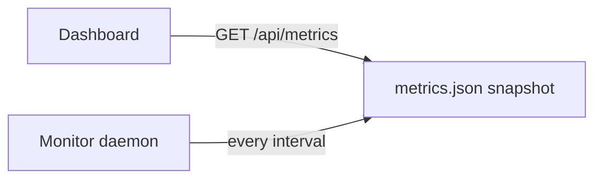

Requires the **Server Monitor** module.

## GET /api/metrics

Return a snapshot of metrics for all monitored connections. When the
daemon is running, this is the last snapshot it wrote
(`~/.dbassistant/runtime/metrics.json`). Without the daemon, this
endpoint may return an empty object.

```bash
curl -H "X-API-Key: $DBTOOL_API_KEY" \
     http://localhost:8000/api/metrics
```

```json
{
  "snapshot_at": "2026-06-01T12:30:00Z",
  "connections": {
    "prod": {
      "db_type": "PostgreSQL",
      "metrics": {
        "connections_active": 14,
        "transactions_per_sec": 120,
        "cache_hit_ratio": 99.4,
        "cpu_percent": 42
      },
      "alerts": []
    },
    "stage": {
      "db_type": "MySQL",
      "metrics": {
        "connections_active": 12,
        "queries_per_sec": 86,
        "cpu_percent": 68
      },
      "alerts": [
        {
          "level": "warning",
          "metric": "cpu_percent",
          "value": 68,
          "threshold": 60,
          "window": "1/3"
        }
      ]
    }
  }
}
```

## GET /api/metrics/{conn}

Live metrics for one connection — opens a new connection if necessary,
runs the same DB-metric collection as the monitor loop, and evaluates
threshold rules.

```bash
curl -H "X-API-Key: $DBTOOL_API_KEY" \
     http://localhost:8000/api/metrics/prod
```

```json
{
  "connection": "prod",
  "db_type": "PostgreSQL",
  "polled_at": "2026-06-01T12:31:04Z",
  "metrics": {
    "connections_active": 14,
    "connections_idle": 22,
    "transactions_per_sec": 121.4,
    "cache_hit_ratio": 99.4,
    "cpu_percent": 42,
    "memory_percent": 67,
    "disk_used_percent": 78,
    "replication_lag_seconds": 0.2
  },
  "raw_floats": {
    "cpu_percent": 42,
    "memory_percent": 67,
    "replication_lag_seconds": 0.2
  },
  "alerts": [],
  "elapsed_ms": 124
}
```

Failure modes:

| Code | Cause |
|------|-------|
| `404` | Connection not found |
| `503` | Engine unreachable — `detail` includes driver error |
| `503` | Monitor module not installed |

## Polling cadence

This endpoint runs a fresh poll on every call. For dashboards refreshing
every few seconds, prefer **`GET /api/metrics`** which serves the
daemon's snapshot — much cheaper.



## Python client

```python
import os, requests, time

HEADERS = {"X-API-Key": os.environ["DBTOOL_API_KEY"]}

while True:
    r = requests.get("http://localhost:8000/api/metrics", headers=HEADERS)
    r.raise_for_status()
    for name, body in r.json().get("connections", {}).items():
        alerts = body.get("alerts", [])
        if alerts:
            print(f"{name}: {len(alerts)} alert(s)")
            for a in alerts:
                print(" ", a)
    time.sleep(30)
```

## See also

- [`monitor` CLI](/cli/monitor/) — same polling, on the command line
- [`daemon` CLI](/cli/daemon/) — background loop
- [Thresholds API](/api/thresholds/)
- [Server Monitor module](/modules/monitoring/)
