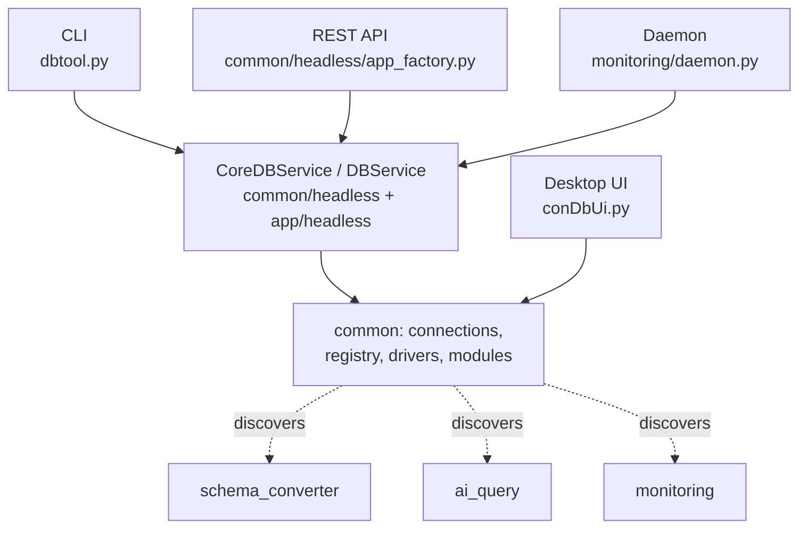

DbAssistant uses a layered, modular architecture. The same business
logic powers the desktop UI, the headless CLI, and the REST API.

## Layers



## Repository layout

```text
DbManagementTool/
├── conDbUi.py                  # shim → common.ui.master_shell
├── dbtool.py                   # shim → app.dbtool
├── api.py                      # shim → app.headless.api:app
│
├── common/                     # SHARED CORE — ships with every module
│   ├── drivers/                # per-engine connectors (con*.py)
│   ├── database_registry.py    # engine → operations mapping
│   ├── connection_manager.py   # encrypted DB connection profiles
│   ├── secret_store.py         # Fernet helpers
│   ├── paths.py                # ~/.dbassistant layout + bootstrap
│   ├── config_loader.py        # INI loader
│   ├── layout_migration.py     # legacy → new layout migration
│   ├── cloud/                  # cloud connection profiles
│   ├── dashboard/              # Dashboard tab + GET /api/dashboard
│   ├── ui/                     # Tkinter shell (master_shell.py)
│   ├── headless/               # FastAPI factory, CoreDBService
│   └── core/                   # module discovery, CLI util
│
├── app/                        # FULL TOOL — master CLI + DBService composer
│   ├── dbtool.py               # master CLI entry
│   └── headless/
│       ├── api.py              # FastAPI mount point
│       └── db_service.py       # DBService (core + module delegation)
│
├── schema_converter/           # MODULE
├── ai_query/                   # MODULE
└── monitoring/                 # MODULE
```

## Module manifest

Every module exposes a `manifest.py` declaring:

```python
ModuleManifest(
    name="migrator",
    display_name="Data Migration",
    folder="schema_converter",
    cli_commands=[...],
    api_router=router,
    ui_panel=...,
    required_paths=[...],
    requirement_files=[...],
)
```

The core discovers manifests at startup. Missing modules are reported
clearly — `dbtool modules` shows which are installed and which are
ready (dependencies satisfied).

## Three surfaces share `DBService`

```python
# CLI
python -m app.dbtool query --conn prod --sql "SELECT 1"

# REST API
POST /api/query { "connection": "prod", "sql": "SELECT 1" }

# Programmatic
from app.headless.db_service import DBService
DBService().execute("prod", "SELECT 1")
```

All three end up calling the same `execute` method on `DBService`.

## Per-module standalone API

A module's own API can be served independently of the full app:

```bash
python -m monitoring api --port 8001
```

This mounts core routes plus only that module's routes — useful for
small containerised deployments.

## Why this matters

- **Test once, ship anywhere.** UI bugs and API bugs are usually the
  same bug because they go through the same service layer.
- **Independent shipping.** You can ship the AI module alone (~5 MB)
  to one team and the full tool to another.
- **Easy to extend.** A new module is a new folder with a `manifest.py`.
  Core picks it up automatically. See [Modules & shipping](/architecture/modules/).
