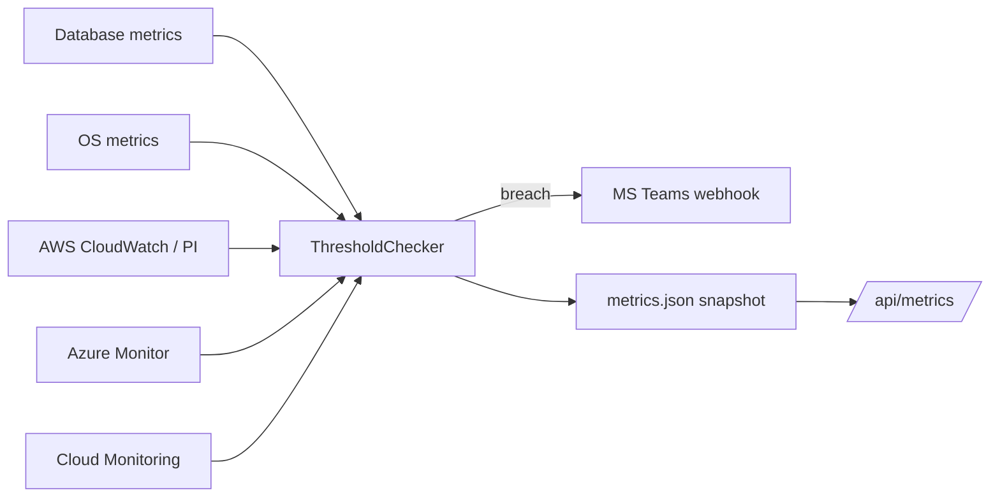

The monitoring module collects metrics from:

- **Database engines** — connections, sessions, cache, latency, IOPS, etc.
- **Host OS** — CPU, memory, disk, load average, processes
- **Remote servers** — same OS metrics via SSH
- **AWS** — RDS / Aurora via CloudWatch + Performance Insights fallback
- **Azure** — SQL, MySQL, PostgreSQL, MariaDB via Azure Monitor
- **GCP** — Cloud SQL via Cloud Monitoring

It then evaluates metrics against threshold rules and dispatches
notifications (currently MS Teams via webhook).

## Architecture



## Quick start

```bash
# Single poll
python dbtool.py monitor --conn prod --once

# Foreground loop
python dbtool.py monitor --conn prod,stage --interval 30

# Background daemon
python dbtool.py daemon start --connections prod --interval 60
python dbtool.py daemon status
python dbtool.py daemon stop
```

## Module configuration

| UI button | File | CLI |
|-----------|------|-----|
| **Monitor Settings** | `monitoring/monitor_config.ini` | `monitor-config show\|set\|restore` |
| **Alert Thresholds** | `monitoring/monitor_thresholds.ini` | `thresholds` |

```bash
python dbtool.py monitor-config show
python dbtool.py monitor notify config
bash monitoring/run_monitor.sh   # shell menu — same CLI surface
```

Notification secrets are encrypted under `~/.dbassistant`, not stored in INI files.

## Threshold rules

Rules live in `monitoring/monitor_thresholds.ini`. Each section is
named `[metric.<source>.<api>.<path>...<rule_id>]`:

```ini
[metric.db.active_connections]
critical = 200
warning = 100
operator = gt
unit = count
window = 3
enabled = true

[metric.aws.cloudwatch.RDS.CPUUtilization]
metric_name = CPUUtilization
critical = 90
warning = 75
operator = gt
unit = percent
window = 3
enabled = true

[metric.azure.azuremonitor.DBforMySQL.flexibleServers.cpu_percent]
metric_name = cpu_percent
critical = 90
warning = 75
operator = gt
unit = percent
enabled = true

[metric.gcp.cloudmonitoring.cloudsql.database.cpu_utilization]
metric_name = cloudsql.googleapis.com/database/cpu/utilization
critical = 0.9
warning = 0.75
operator = gt
unit = ratio
enabled = true
```

Local DB metrics also support **per-engine** namespaces
(`[metric.db.<engine>.<rule_id>]` for `mysql`, `mariadb`, `oracle`,
`postgresql`, `sqlite`). The engine section is looked up first and falls
back to the generic `[metric.db.<rule_id>]` rule:

```ini
[metric.db.postgresql.active_connections]
warning = 150
critical = 300
operator = gt
unit = count
enabled = true
```

See [Threshold rules schema](/reference/threshold-rules/) for the
complete reference.

Inspect rules without polling a real DB:

```bash
python dbtool.py thresholds list
python dbtool.py thresholds list --source db --path mysql      # per-engine rules
python dbtool.py thresholds show --source aws --metric CPUUtilization \
    --path cloudwatch.RDS
python dbtool.py thresholds check --source db --path postgresql \
    --metric active_connections --value 250
```

## Alerts

Set `ALERT_TEAMS_WEBHOOK_URL` in `.env`:

```dotenv
ALERT_TEAMS_WEBHOOK_URL=https://outlook.office.com/webhook/...
```

Test the channel:

```bash
python dbtool.py notify send --severity WARNING --message "test alert"
```

## REST API

```bash
# Snapshot (from daemon's metrics.json if running)
curl -H "X-API-Key: $DBTOOL_API_KEY" \
     "http://localhost:8000/api/metrics"

# Live metrics for one connection (also evaluates thresholds)
curl -H "X-API-Key: $DBTOOL_API_KEY" \
     "http://localhost:8000/api/metrics/prod"

# OS metrics
curl -H "X-API-Key: $DBTOOL_API_KEY" \
     "http://localhost:8000/api/os/metrics?disk=/"

# Threshold rules
curl -H "X-API-Key: $DBTOOL_API_KEY" \
     "http://localhost:8000/api/thresholds?source=db"
```

## Cloud monitoring

See per-provider guides:

- [AWS — RDS / Aurora / Performance Insights](/cloud/aws/)
- [Azure — SQL / MySQL / PostgreSQL / MariaDB](/cloud/azure/)
- [GCP — Cloud SQL](/cloud/gcp/)

### Cloud metric lookback (`monitor_config.ini`)

Cloud metrics APIs are time-range queries: every poll asks the provider
for datapoints over a recent window and then displays the **newest** one
(no averaging). Because providers publish with a delay, the window has to
be wide enough to contain a published point — too narrow shows "No data",
too wide can let a stale value still look "latest".

That window is configurable per provider in `monitoring/monitor_config.ini`
— a module-owned file that ships with the Monitoring module independently
of `config.ini`:

```ini
[cloud.lookback]
aws_lookback_minutes = 10
azure_lookback_minutes = 15
gcp_lookback_minutes = 15
```

Notes:

- This is **not** the poll/refresh rate (that's `metrics_refresh_interval` in
  `monitor_config.ini` for the UI, or `--interval` for the CLI/daemon). Widening
  the window does not poll more often; it only widens the search per poll.
- Valid range is `1`–`1440` minutes; invalid/missing values fall back to the
  built-in defaults shown above.
- The file is re-read when it changes, so edits apply on the next refresh —
  no restart needed.
- If the live file is absent, the tool falls back to
  `monitor_config.ini.example`, then to the built-in defaults.

## Daemon

```bash
# Start (Unix double-fork, detaches)
python dbtool.py daemon start --connections prod,stage --interval 60

# Foreground (Docker / systemd)
python dbtool.py daemon start --foreground

python dbtool.py daemon status
python dbtool.py daemon stop
```

Files written by the daemon:

| Path | Content |
|------|---------|
| `~/.dbassistant/runtime/daemon.pid` | PID file |
| `~/.dbassistant/runtime/daemon.log` | Structured log |
| `~/.dbassistant/runtime/metrics.json` | Last-poll snapshot |

The REST API serves `metrics.json` for `GET /api/metrics` when the
daemon is running, so dashboards stay fresh without polling the DB
directly.

See [Daemon & systemd](/operations/daemon/) for service-unit examples.
